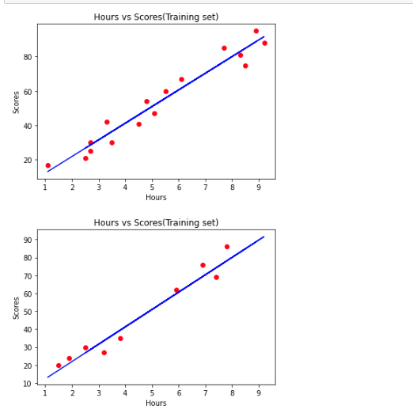

# Implementation-of-Simple-Linear-Regression-Model-for-Predicting-the-Marks-Scored

## AIM:
To write a program to implement the simple linear regression model for predicting the marks scored.

## Equipments Required:
1. Hardware – PCs
2. Anaconda – Python 3.7 Installation / Moodle-Code Runner

## Algorithm
~~~
STEP 1:import the required libraries 
STEP 2:import the csv file
STEP 3:Declare X and y values with respect to the dataset
STEP 4:plot the graph using matplotlib library
STEP 5:print the plot
STEP 6:End the program
~~~

## Program:
```
~~~
Program to implement the simple linear regression model for predicting the marks scored.
Developed by:Umar Mohmaed E 
RegisterNumber:212220040173 
~~~
import numpy as np
import pandas as pd
import matplotlib.pyplot as plt
dataset=pd.read_csv('student_scores - student_scores.csv')
dataset.head()
X=dataset.iloc[:, :-1].values
X
y=dataset.iloc[:,1].values
y
from sklearn.model_selection import train_test_split
X_train,X_test,y_train,y_test=train_test_split(X,y,test_size=1/3,random_state=0)
from sklearn.linear_model import LinearRegression
regressor=LinearRegression()
regressor.fit(X_train,y_train)
y_pred=regressor.predict(X_test)
y_pred
y_test
plt.scatter(X_train,y_train,color='red')
plt.plot(X_train,regressor.predict(X_train),color='blue')
plt.title("Hours vs Scores(Training set)")
plt.xlabel("Hours")
plt.ylabel("Scores")
plt.show()
plt.scatter(X_test,y_test,color='red')
plt.plot(X_train,regressor.predict(X_train),color='blue')
plt.title("Hours vs Scores(Training set)")
plt.xlabel("Hours")
plt.ylabel("Scores")
plt.show()
*/

```

## Output:


## Result:
Thus the program to implement the simple linear regression model for predicting the marks scored is written and verified using python programming.
